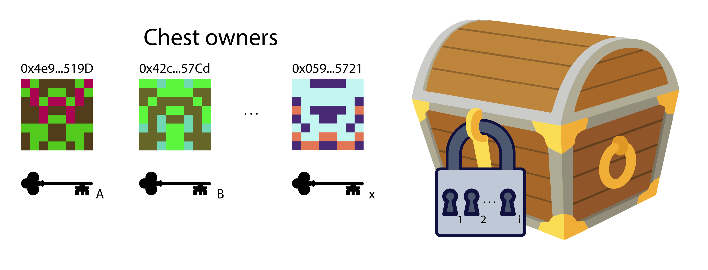

# Based on -> 🏗 Scaffold-ETH

# 🔑 Multi sig chest that uses off chain signatures(with meta transactions).

Hi, to all! The objective of this topic is to build a multisig wallet that uses meta-transactions in order to spend value contained in it. A meta-transaction is a regular Ethereum transaction which contains another transaction, the actual transaction. The actual transaction is signed by a user or a group of users and then sent to an operator, in this case the operator is the wallet contract and he is who checks the correctness of the signatures broadcast the transaction to the blockchain.

### 📚 High level aproach.

In a high level aproach we can understand the multisig wallet as a locked chest where the lock can have multiple keyholes and wee need to fit all of them to open it. Wee can have more keys than keyholes if wee want, we are going to program it as we want, awesome isn't it?

 

To delve more into technicalities we are going to trate the 'x' keys as de multisig wallet owners private keys, and the 'i' keyholes as the `signaturesRequired` design parameter that represent the number of siganatures required to open the chest.

### 🧠 Aplication description.

The application consists, first of all, of a smart contract stored on the blockchain (On-Chain) that receives a metatransaction (containing enough data to execute the actual transaction "Tx" and a set of signatures) and verifies the signatures and executes the actual transaction.
Secondly, of a front-end (Off-Chain) who sign the actual transaction, build the metatransaction and calls the MultiSigWallet contract.

bellow is shown a schema that describes the parts of the aplication and how it interact.

 

### 🛠 Let's buidl!

To build the aplicaton we are going to use the scaffold-eth basic project.
