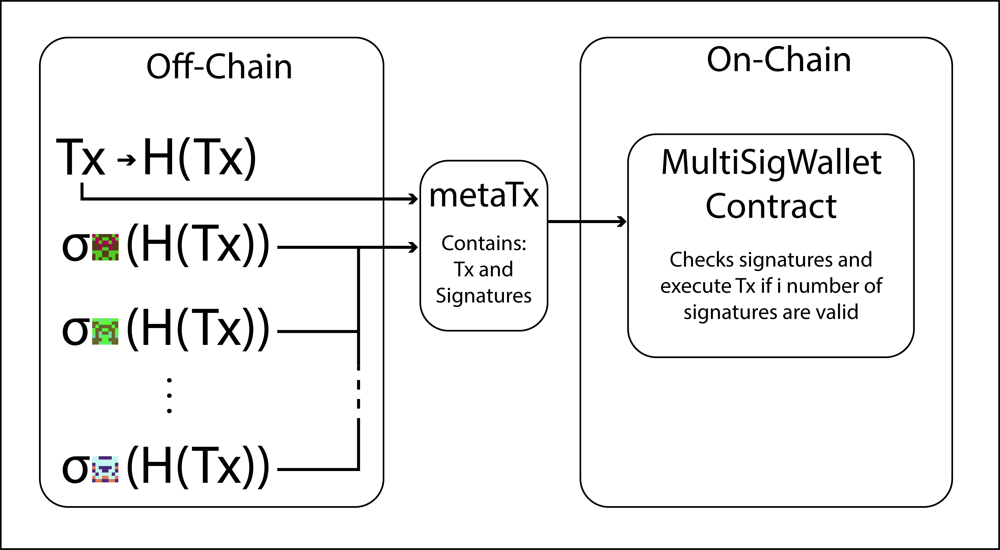

# 🏗 Scaffold-ETH - 🔑 Meta transaction multi sig wallet.


Hi, to all! The objective of this topic is to build a multisig wallet that uses meta-transactions in order to spend value contained in it. A meta-transaction is a regular Ethereum transaction which contains another transaction, the actual transaction. The actual transaction is signed by a user or a group of users and then sent to an operator, in this case the operator is the wallet contract and he is who checks the correctness of the signatures broadcast the transaction to the blockchain.

## 📚 High level aproach.

In a high level aproach we can understand the multisig wallet as a locked chest where the lock can have multiple keyholes and wee need to fit all of them to open it. Wee can have more keys than keyholes if wee want, we are going to program it as we want, awesome isn't it?

<p align="center" >
 
</p>

To delve more into technicalities we are going to trate the 'x' keys as de multisig wallet owners private keys, and the 'i' keyholes as the `signaturesRequired` design parameter that represent the number of siganatures required to open the chest.

## 🧠 Aplication description.

The application consists, first of all, of a smart contract stored on the blockchain (On-Chain) that receives a metatransaction (containing enough data to execute the actual transaction "Tx" and a set of signatures) and verifies the signatures and executes the actual transaction.
Secondly, of a front-end (Off-Chain) who sign the actual transaction, build the metatransaction and calls the MultiSigWallet contract.

bellow is shown a schema that describes the parts of the aplication and how it interact.

<p align="center" >
 
</p>

## 🛠 Let's buidl!

We are going to use the scaffold-eth project.

Required: [Node](https://nodejs.org/en/) plus [Yarn](https://classic.yarnpkg.com/lang/en/docs/install/) and [Git](https://git-scm.com/downloads)

```
git clone https://github.com/scaffold-eth/scaffold-eth meta-multi-sig
```
```
cd meta-multi-sig
git checkout meta-multi-sig
yarn install
yarn start
```

> in a second terminal window, start your 📱 frontend:

```
cd simple-nextjs-nft-example
yarn chain
```

> in a third terminal window, 🛰 deploy your contract:

```
cd simple-nextjs-nft-example
yarn deploy
```

📱 Open http://localhost:3000 to see the app

### Chest main pannel

Inside the main tab of the app "AppHome" in first place we found the chest pannel  that shows the stats of the multisig, here we bla bla bbla

# ------------chest image

> You can take the onwership of the chest during deployment editing the deployment script  /packages/hardhat/deploy/00_deploy_meta_multi_sig_wallet.js.

# ------------setting owner image (remember to comment)

> Also you can fund the chest uncommenting the funding lines in the same script.

# ------------funding image

now that you have your multisig founded and the ownership of the chest you can send metatx to it you can see now the funding transaction in founding events, checkout how this work in .... .

### sign and execute a TX
with a contract of the chest created your are able to send metaTx to the contract, but it hash to be signed in orther that whatever it is the signer of metaTX the contract can verify who has signed the real tx

> Add  the tx info tn the TX hash calculator and claculate the hash let the calldata field as 0x we going to explain latter about it

# ------------- Hash calculator image

> Sign the Tx in the signer checkout how the signer works in the react app

# -------------- Hash signer image


> Now go to the tx executer 

# -------------- Tx executer image

you will see that the reciver wallet of funds has recived the funds from the chest

###  Ownership control

introducing logic in the contract you are in grade of modify the onwers and the signatures needed to ... bla bla bla

> Edit /packages/hardhat/contracts/MetaMultiSigWallet.sol and uncoment the acces control functions

# -------- enable ownership control (remember to comment the contract part)

> 🛰 deploy your contract again:

```
yarn deploy --reset
```

now you can send a metaTx to de contract thath contains a calldata who defines wat function call the real TX.

> 🔥 We'll use burner wallets on by opening a new incognito window and navigate it to http://localhost:3000. You'll notice it has a new wallet address in the top right. whe are going to add this wallet as signer.

# ----------- burnable wallet image

> copy this addres and return to normal browser window iinput addsigner  funcbla bla bal checkout how the function woek 

# ------------ calculate call data image
> repeat the Sign and execute TX steps using the calculated calldata

# --------- image of tx hash generation with calldata

You can now see in the panel that a incognito wallet addres is added as sginer, you can use this procediment ot execute any fucntion of any contract

# --------- image panel with new signer


